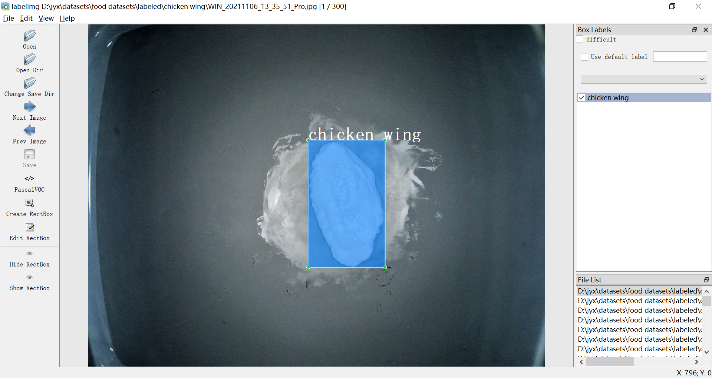

# 基于目标检测的数据集制作

- [x] [数据采集与归档](#数据采集与归档)
- [x] [数据集配置文件](#数据集配置文件)
- [x] [数据预处理](#数据预处理)
- [x] [数据标注](#数据标注)
- [ ] [转换至可训练的标准数据集](#转换至可训练的标准数据集)
  - [x] [转换成 VOC 格式](#转换成-VOC-格式)
  - [x] [转换成用于 YOLOv5 的 COCO 格式](#转换成用于-YOLOv5-的-COCO-格式)


# Notes
- 该工程对处理的数据集有一定限制：数据集需要提前按照类别存放在各个类别文件夹中，即需要满足一张图片只能包含多个同类的目标。


# 数据采集与归档
> 首先要明确的是，该项目仅仅是脚本库，不包括数据集。

将采集到的数据放置在 `dataset-custom/src` 目录下面，并且按照类别归档至对应文件夹下，参考的文件目如下

```bash
├── dataset-yolo-main  #该项目文件夹
└── dataset-custom     # 数据集文件夹
    └── src            # 原始图片文件，按照文件夹分类
        ├─ A           # 类别 A
        ├─ B           # 类别 B
        └─ ...
```
> 必须保证原始数据都在 `src` 内，否则脚本无法自动化处理

# 数据集配置文件
为了便于对多个数据集进行操作，我们采用配置文件 `config/*.yaml` 对多个数据集进行配置

```yaml
dataset: <path_to_dataset>

trainset_percent: 0.8
```

你可以参考 `config/custom.yaml` 新建一个 `config/custom.yaml` ，并将配置参数 `dataset `修改成对应目录即可，例如
```yaml
dataset: ../dataset-custom
```
> 数据集的路径建议使用绝对路径

在运行脚本的时候，只要加上参数 `--conf config/custom.yaml` 就可以处理多个不同的文件夹，如果不添加额外参数，则默认配置文件为 `config/custom.yaml`


# 数据预处理
执行 `scripts/rename.py`
```bash
python3 scripts/rename.py [--conf] [--not_rename]
# example
python3 scripts/rename.py --conf config/custom.yaml
python3 scripts/rename.py --conf config/custom.yaml --not_rename
```

运行成功后，`src`目录内全部文件会按照目录名进行重命名，并且在 `src` 同级目录下产生 `labeled` 目录，在这里进行标注，例如
```bash
├── dataset-yolo-main  #该项目文件夹
└── dataset-custom     # 数据集文件夹
    ├── src            # 原始数据，按照类别进行归档
    │   ├── A
    │   ├── B
    │   └── ...
    └── labeled        # 重命名后的文件，在这里进行标注
        ├── A
        ├── B
        └── ...
```

`labeled` 目录是用于后续步骤[数据标注](#数据标注)的目录，这样我们可以在不破坏原始数据对情况下完成数据处理，如果不再需要原始数据，在完成此步骤后，可以删除 `src` 目录

>如果拿到该工程时已经按类别标注好了数据集，即已经获得了类似`labeled`文件夹，则可以用`labeled_rename.py`来重命名`.jpg`和`.xml`
```bash
python scripts/labeled-rename.py [--conf]
# example
python scripts/labeled-rename.py
```
# 数据标注

在前面步骤中生成的 `labeled` 目录是用于数据标注的目录，你可以选择使用图像注释工具 labelImg 来快速进行标注。

[labelImg](https://github.com/tzutalin/labelImg) 是 Python 编写、基于 Qt 图形界面的软件，标注以 PASCAL VOC 格式（ImageNet 使用的格式）另存为 `.xml` 文件。此外，它还支持 YOLO 格式。

使用pip安装LabelImg是最简单的方式（windows用户强烈推荐此方法）
```bash
pip install labelimg -i https://pypi.tuna.tsinghua.edu.cn/simple
```
安装完之后会自动把LabelImg添加到环境变量中，这样你就可以在命令行中输入：
```bash
labelimg
```

在 windows 下启动后的界面如下


- 打开文件 : 标注单张图像（不推荐使用）
- **打开目录** : 打开数据集存放的目录，目录下应该是待标注的图像
- **改变存放目录**: 标注文件 `.xml` 存放的目录
- 下一个图片: 快捷键`d`
- 上一个图像: 快捷键`w`
- **保存**: 保存标记结果，快捷键 `Ctrl+s`,也可在菜单栏的`View`中将`Auto Save Mode`勾选上（推荐），这样切换到下一张图片时，就会自动把上一张标注的图片标签保存下来
- **数据集格式**: `PascalVOC` 和 `YOLO` 可选，一般选择 `PascalVOC` 即可，需要 `YOLO` 可以之后进行转换
- labelImg 快捷键

| 快捷键 |           功能           | 快捷键 |       功能       |
| :----: | :----------------------: | :----: | :--------------: |
| Ctrl+u |    从目录加载所有图像    |   w    |  创建一个矩形框  |
| Ctrl+R |   更改默认注释目标目录   |   d    |    下一张图片    |
| Ctrl+s |     保存当前标注结果     |   a    |    上一张图片    |
| Ctrl+d |   复制当前标签和矩形框   |  del   | 删除选定的矩形框 |
| space  |  将当前图像标记为已验证  | Ctrl+  |       放大       |
|  ↑→↓←  | 键盘箭头移动选定的矩形框 | Ctrl–  |       缩小       |

点击 `Create RectBox`（快捷键`w`） 创建一个矩形框，画出范围，并且每个类别都有对应的颜色加以区分


完成一张图片的标注后，点击 `Next Image`（快捷键`d`）切换到下一张图片，重复上述操作即可。

# 转换至可训练的标准数据集
当标注完成后，我们就需要将图像和标注文件转换为我们所需要的数据格式
可用的转换流程如下
```bash
labeled -> VOC  # to PASCAL VOC
            └─> YOLO -> COCO  # to YOLOv5 COCO
```
- [x] [转换成 VOC 格式](#转换成-VOC-格式)
- [x] [转换成用于 YOLOv5 的 COCO 格式](#转换成用于-YOLOv5-的-COCO-格式)


## 转换成 VOC 格式

<!-- **VOC2012** 数据集描述：
- **Annotations**: 存放了数据`xml`格式存储的标签，里面包含了每张图片的`bounding box`信息，主要用于**目标检测**。
- **ImageSets**: ImageSets中的Segmentation目录下存放了用于分割的train, val, trainval数据集的索引。
- **JPEGImages**: 这里存放的就是JPG格式的原图，包含17125张彩色图片，但只有一部分(2913张)是用于分割的。
- **SegmentationClass**: 语义分割任务中用到的label图片，PNG格式，共2913张，与原图的每一张图片相对应。
- **SegmentationObject**: 实例分割任务用到的label图片，在语义分割中用不到，这里不详解介绍。
--- -->

转换成 VOC 数据集流程如下
```bash
labeled -> VOC  # to PASCAL VOC
```

执行 `labeled-voc.py` 将已经标记好的数据集转化成VOC格式
```bash
python scripts/labeled-voc.py [--conf]
# example
python scripts/labeled-voc.py
```

运行后会在 VOC 目录下类别文件 `classes.names` 和训练集文件 `train.txt` 、验证集文件 `val.txt`
```bash
·
└── dataset-custom  # 数据集文件夹
    ├── src         # 原始数据，按照类别进行归档
    ├── labeled     # 压缩、重命名后的文件，在这里进行标注
    └── VOC         # VOC 标准数据集，用于训练
        ├── Annotations
        ├── ImageSets
        │   └── Main
        │       ├── classes.names
        │       ├── train.txt
        │       └── val.txt
        └── JPEGImages            
```

## 转换成用于 YOLOv5 的 COCO 格式
转换成用于 [ultralytics/yolov5](https://github.com/ultralytics/yolov5) 的 COCO 数据集流程如下
```bash
labeled -> VOC -> YOLO -> COCO  # to YOLOv5 COCO
```

对每一次转换逐步运行，首先从原始标注数据转换成 VOC
```bash
python ./scripts/labeled-voc.py [--conf]
# example
python ./scripts/labeled-voc.py
```

从 VOC 转换成 YOLO
```bash
python ./scripts/voc-yolo.py [--conf]
# example
python ./scripts/voc-yolo.py
```

从 YOLO 转换成 COCO(yolov5)
```bash
python ./scripts/yolo-coco.py [--conf]
# example
python ./scripts/yolo-coco.py
```

运行后得到 YOLOv5 的 COCO 数据集，包含 `images`,`labels` 目录，目录下分别包含子目录 `train`,`val` 
```bash
·
└── dataset-custom  # 数据集文件夹
    ├── src         # 原始数据，按照类别进行归档
    ├── labeled     # 压缩、重命名后的文件，在这里进行标注
    ├── VOC         # VOC 数据集，用于训练
    └── coco        # coco 数据集，用于训练
        ├── images
        │   ├── train
        │   └── val
        └── labels   
            ├── train
            └── val
```

